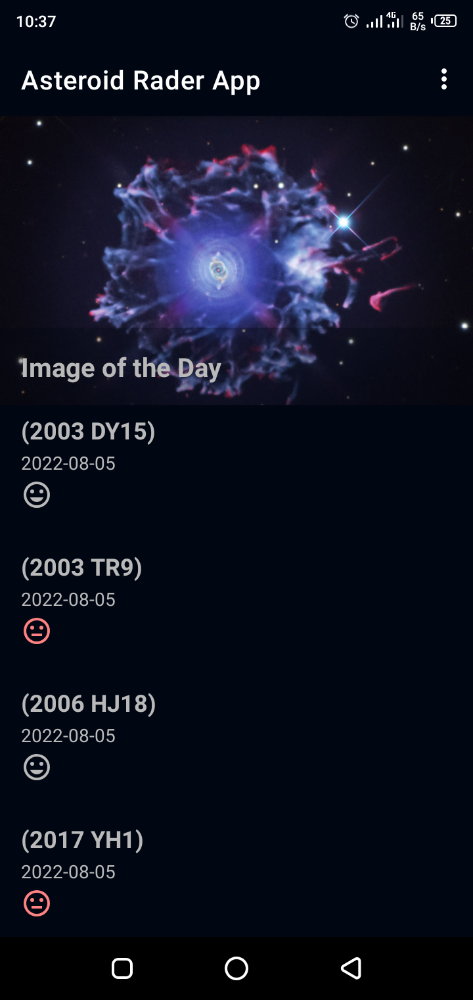
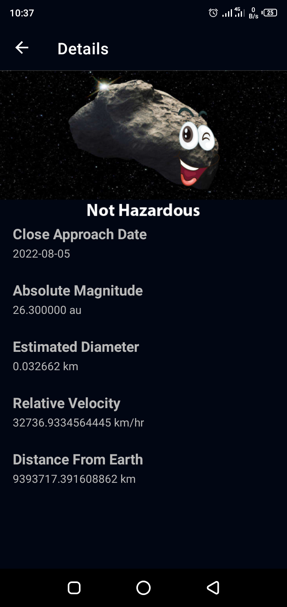
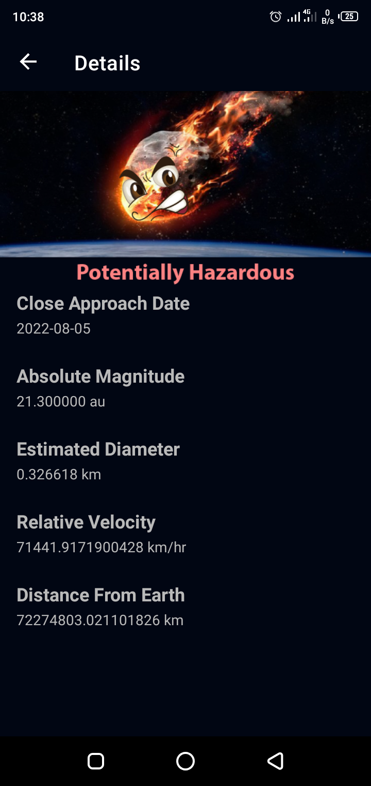
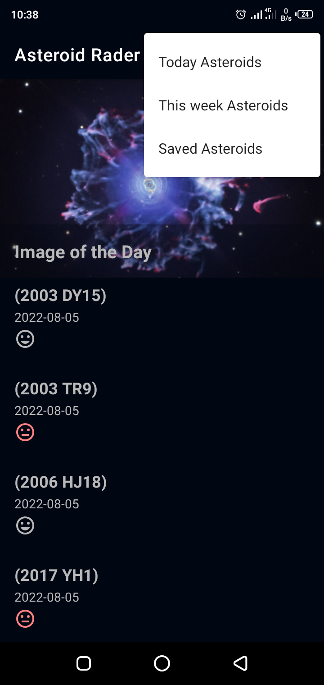

# Asteroid-Rader-App

## About
Asteroid App which shows the asteroids detected by NASA that pass near Earth. It displays the date, size, velocity, 
distance from the earth and if they are potentially hazardous

## Features
* MVVM Architecture 
* Retrofit library for interacting with REST APIs
* RecyclerView for reuse and efficient loading of views
* ViewModel for persisting data during configuratioon change
* Moshi library for parsing JSON into Kotlin data classes
* DataBinding of Layouts and Views
* Coil image library for efficient loading of images
* Room library for local caching of data
* LiveData observation for changes
* WorkManager for periodic schedule of background tasks
* Navigating between fragments within a single Activity using Android Jetpack Navigation Component
* Kotlin Coroutine for asynchronous operations

## Requirements
* You need and API key from the NASA API to use this App
* To get an API key, click https://api.nasa.gov/

## App Demo

